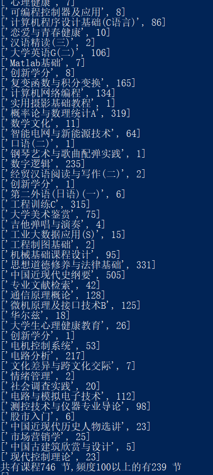

### 特点尝试

* 采用装饰器catch_error来对数据库操作函数进行装饰
* 采用javascript不定长参数对函数统一封装
* 梳理flask目录结构特点
* ajax异步请求更新进度条

## 遇到的一些问题

对字段进行编码之后大概有9000+差，4000+中，1200+良，675个优，可以看出数据分布是非常不平均的，在这种情况下生成的规则是极其不均匀的，只能得到课程差评之间的规则，如下图所示

**解决方案**

* 采用抽样的方式来生成规则，考虑到apriori算法的特殊性，它是无监督学习，因此不能简单使用上采样或下采样的方式进行优化。比较可行的方案是对于不同的成绩等级（优良中差）分别生成规则，这样使得每一类在它所包含的数据集中都比较均衡，且能生成不同级别的规则，既能充分利用数据，又解决不平衡问题
* 为了提高计算效率，将课程出现频度小于100的课程过滤掉，减少运算时间，同时有助于生成更加有效的规则

### 参考文章

1. [Organizing your project](<https://exploreflask.com/en/latest/organizing.html>)
2. [flask组件化开发：Blueprint(蓝图)](<https://www.jianshu.com/p/0913a116215f>)
3. [Javascript 函数变长参数(…rest)](<https://blog.csdn.net/m0_37263637/article/details/83186229>)
4. [JS中let和var的区别](https://www.cnblogs.com/asand/p/7205632.html)
5. [前端动态获取后台处理进度显示在进度条上](<https://blog.csdn.net/qq965194745/article/details/80034993>)
6. [jQuery getJSON两种参数传递](<https://blog.csdn.net/lushijie5516/article/details/9139255>)
7. [Flask - Passing parameters to a JQuery $.getJSON callback](https://stackoverflow.com/questions/40369511/flask-passing-parameters-to-a-jquery-getjson-callback)

